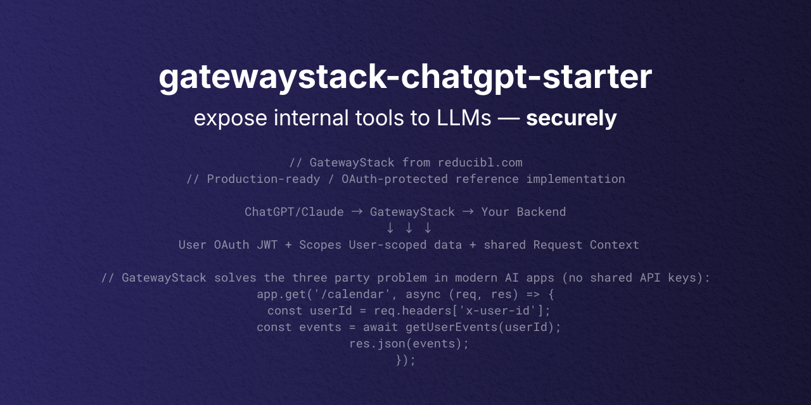

<p align="center">
  
</p>

<p align="center">
  <a href="https://opensource.org/licenses/Apache-2.0">
    
  </a>
  <a href="https://www.typescriptlang.org/">
    
  </a>
</p>

<p align="center"><strong>Build your own MCP server with real user identity</strong></p>

<p align="center">User-scoped AI tools for ChatGPT, Claude, and any MCP client — powered by <a href="https://gatewaystack.com">GatewayStack</a></p>

## What this is

A production-ready starter for building MCP servers where **every AI request is tied to a real, verified user**. Fork it, swap in your tools, deploy.

If your tools need to know _which user_ is calling — not just _that someone_ is calling — this is the pattern.

```
User (Alice) → AI Client (ChatGPT) → Your MCP Server (this repo) → Your Backend
                                          │
                                    ┌─────┴─────┐
                                    │ verify JWT │
                                    │ check scope│
                                    │ map sub→uid│
                                    │ forward tok│
                                    └────────────┘
```

## Quick start

```bash
git clone https://github.com/davidcrowe/gatewaystack-chatgpt-starter
cd gatewaystack-chatgpt-starter
npm install
cp .env.example .env   # edit with your OAuth config
npm run dev
```

## What's included

| Layer | What it does | Powered by |
|-------|-------------|------------|
| **OAuth discovery** | `/.well-known/*` endpoints so ChatGPT prompts login | built-in |
| **JWT verification** | RS256/JWKS verification of access tokens | `@gatewaystack/identifiabl` |
| **Scope enforcement** | per-tool scope declarations, deny if missing | built-in |
| **Identity mapping** | OAuth `sub` → your internal `uid` | built-in |
| **Token forwarding** | same Bearer token forwarded to your backend | `@gatewaystack/proxyabl` |
| **Audit logging** | structured request context logging | `@gatewaystack/explicabl` |
| **Rate limiting** | per-IP request throttling | `express-rate-limit` |
| **Request context** | identity propagation across async boundaries | `@gatewaystack/request-context` |

## Demo tools

Ships with working demos that prove the identity pattern end-to-end:

| Tool | What it proves |
|------|---------------|
| `whoami` | OAuth identity flows through the full chain |
| `echo` | basic tool execution with scope enforcement |
| `seedMyNotes` / `listMyNotes` / `addNote` | user-scoped data isolation (in-memory) |
| `crmInit` / `crmGetSalesSummary` | user-scoped SQLite CRM with HMAC-derived keys |
| `crmExplainAccess` / `crmAttemptCrossUserRead` | cross-user access denial proof |

## Customize for your app

You need to change **three things**:

### 1. Tool registry (`src/tools/tools.ts`)
Define your tools, their required scopes, and MCP descriptors.

### 2. Identity mapping (`src/handlers/authHelpers.ts`)
Map OAuth `sub` → your internal user id in `subjectToUid()`.

### 3. Backend execution (optional)
Keep tools local for demos, or configure Proxyabl to forward requests to your real backend with the OAuth token attached.

## Architecture

```
src/
├── gateway/toolGateway.ts        # main HTTP handler (MCP + REST + well-known)
├── handlers/
│   ├── authHelpers.ts            # JWT verify, scope check, identity mapping
│   ├── mcpHandler.ts             # MCP JSON-RPC (initialize, tools/list, tools/call)
│   ├── oauthConfig.ts            # OAuth env config (issuer, audience, JWKS)
│   ├── wellKnown.ts              # OAuth discovery endpoints
│   └── httpHelpers.ts            # CORS, fetch helpers
├── server/expressServer.ts       # Express app + rate limiting
├── tools/tools.ts                # tool registry + scope map + MCP descriptors
├── demo-api/                     # demo backend (notes + CRM)
│   ├── crm/                      # SQLite CRM with HMAC user keys
│   └── store.ts                  # in-memory note storage
└── tests/                        # vitest unit tests
```

## Endpoints

| Route | Method | Purpose |
|-------|--------|---------|
| `/mcp` | POST | MCP JSON-RPC (tools/list, tools/call, initialize) |
| `/.well-known/oauth-protected-resource` | GET | OAuth discovery for ChatGPT |
| `/.well-known/oauth-authorization-server` | GET | OAuth server metadata |
| `/.well-known/openid-configuration` | GET | OIDC discovery (proxied) |
| `/` | GET | Health check + service info |
| `/debug-token` | GET | Verify bearer token, show claims |

## Deployment

- **Local**: `npm run dev` (tsx)
- **Cloud Run**: `npm run build && npm start` (recommended)
- Any Node 20+ container runtime

See [docs/deploy-your-own.md](./docs/deploy-your-own.md) for CI/CD setup.

## Auth providers

Works with any OAuth 2.0 / OIDC provider that issues JWT access tokens (JWS):

- [Auth0 setup guide](./docs/auth0-setup-guide.md)
- [Other IdPs (Okta, Azure AD, Google)](./docs/other-idps.md)

## Testing

```bash
npm test          # 26 unit tests (vitest)
npm run build     # TypeScript compilation check
```

## Common issues

| Symptom | Cause |
|---------|-------|
| `401 + invalid_token` | issuer/audience mismatch or JWKS not reachable |
| `ACCESS_TOKEN_IS_ENCRYPTED_JWE` | auth provider returning JWE instead of JWS |
| `tools/list keeps prompting OAuth` | `WWW-Authenticate` header or `/.well-known/oauth-protected-resource` misconfigured |

## Related

- [gatewaystack.com](https://gatewaystack.com) — the governance platform
- [gatewaystack-connect](https://github.com/davidcrowe/gatewaystack-connect) — multi-tenant MCP gateway
- [@gatewaystack packages](https://github.com/davidcrowe/GatewayStack) — npm monorepo

Built by [reducibl applied AI studio](https://reducibl.com)
