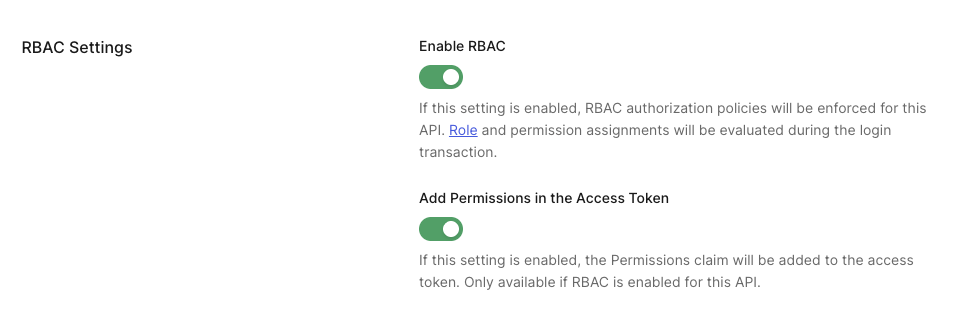
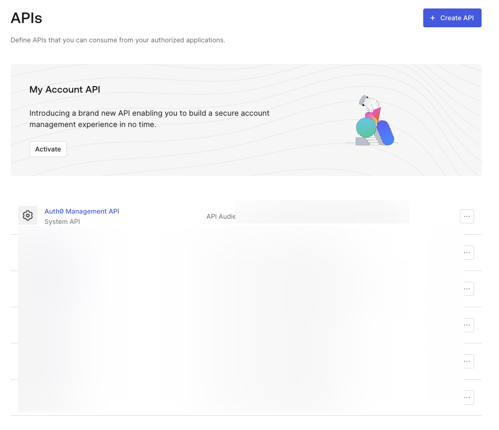
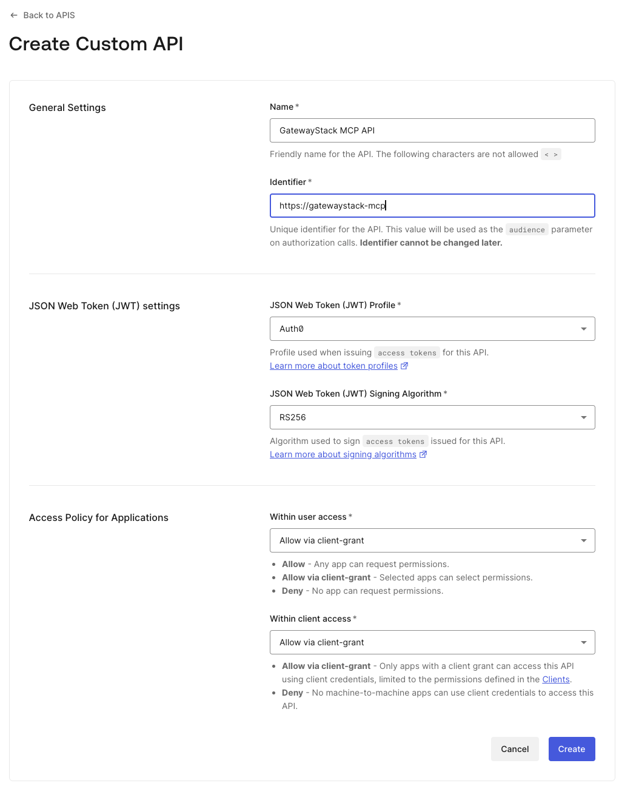
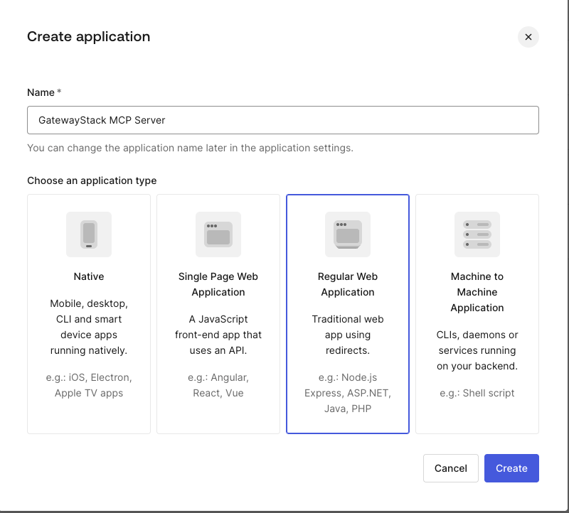
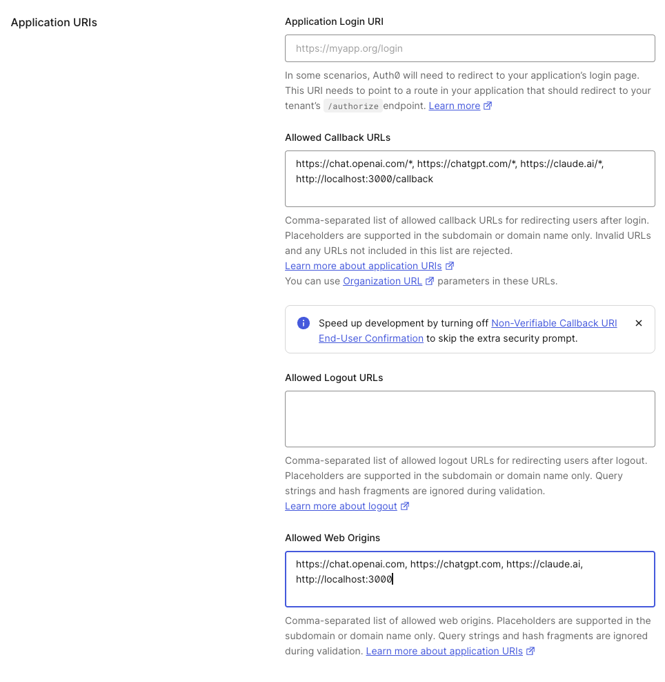
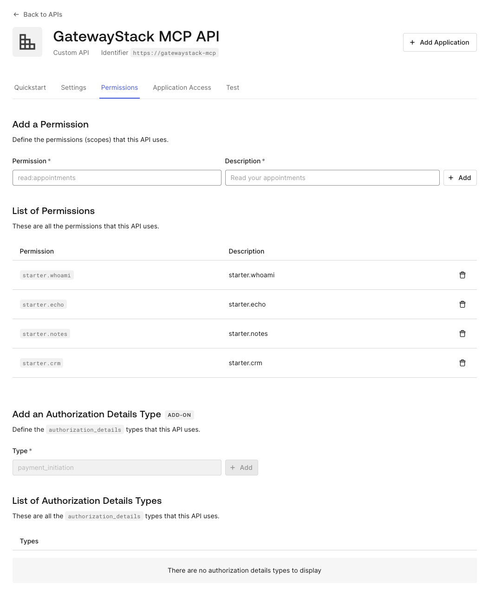
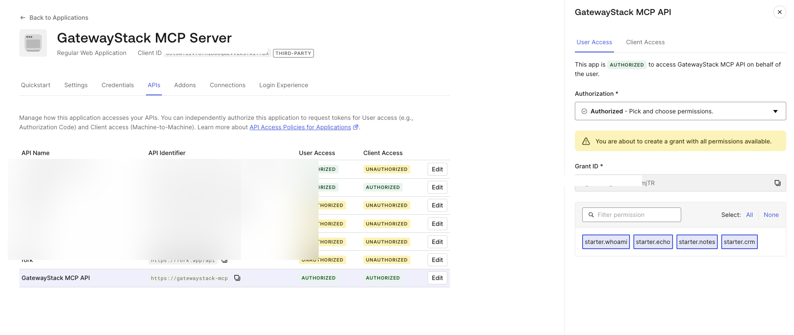

# Auth0 Setup Guide

Configure Auth0 as the OAuth provider for your GatewayStack MCP server. By the end of this guide, your MCP server will verify user identity on every tool call via Auth0-issued JWTs.

**Time:** ~15 minutes (manual) or ~2 minutes (scripted)

---

## Option A: Automated Setup (Recommended)

The setup script creates your Auth0 API, application, scopes, and writes your `.env` in one command.

### Prerequisites

Install the Auth0 CLI:

```bash
brew install auth0/auth0-cli/auth0
# or: npm install -g auth0-cli
```

Authenticate (one-time):

```bash
auth0 login
```

### Run the script

```bash
npm run setup:auth0
```

That's it. The script will:

1. Detect your Auth0 tenant
2. Create an API (`GatewayStack MCP API`) with RS256 signing
3. Add the starter scopes (`starter.whoami`, `starter.echo`, `starter.notes`, `starter.crm`)
4. Create a Regular Web Application with MCP-compatible callback URLs
5. Authorize the application for the API with all scopes
6. Write `OAUTH_ISSUER` and `OAUTH_AUDIENCE` to your `.env`

**Options:**

```bash
# Use a specific tenant
npm run setup:auth0 -- --tenant your-tenant.us.auth0.com

# Custom names
npm run setup:auth0 -- --api-name "My API" --app-name "My App"

# Preview without making changes
npm run setup:auth0 -- --dry-run
```

**One manual step remains:** the Auth0 CLI can't toggle RBAC settings. After the script runs, go to Auth0 Dashboard → APIs → your API → Settings and enable:

- **Enable RBAC**
- **Add Permissions in the Access Token**



Then skip to [Step 6: Test](#6-test).

---

## Option B: Manual Setup

### 1. Create an API

Go to **Auth0 Dashboard → Applications → APIs → Create API**.



Fill in:

- **Name:** `GatewayStack MCP API` (or any name you prefer)
- **Identifier:** `https://gatewaystack-mcp` (this becomes your `OAUTH_AUDIENCE`)
- **Signing Algorithm:** RS256



Save the **Identifier** — you'll need it for your `.env`.

> **Why RS256?** RS256 uses asymmetric keys. Your MCP server verifies tokens using Auth0's public JWKS endpoint without ever seeing the private key. This is the only algorithm GatewayStack supports by default.

---

### 2. Create an Application

Go to **Auth0 Dashboard → Applications → Applications → Create Application**.

Select **Regular Web Application**.



In the application's **Settings** tab, configure:

**Allowed Callback URLs:**

```
https://chat.openai.com/*, https://chatgpt.com/*, https://claude.ai/*, http://localhost:3000/callback
```

**Allowed Web Origins:**

```
https://chat.openai.com, https://chatgpt.com, https://claude.ai, http://localhost:3000
```



> **What are these URLs?** When ChatGPT, Claude, or another MCP client initiates OAuth login, Auth0 redirects the user back to these URLs after authentication. Each MCP client has its own callback pattern.

---

### 3. Token configuration

Go to your **API → Settings** tab.

Ensure:

- **Access tokens** are **JWT (JWS)** format — not opaque
- **Token encryption (JWE)** is disabled
- **Enable RBAC** is checked
- **Add Permissions in the Access Token** is checked


> **Why "Add Permissions in the Access Token"?** Without this, Auth0 issues tokens with `openid email profile` but not your custom scopes. The MCP server checks scopes on every tool call — if the token doesn't carry `starter.whoami`, the `whoami` tool returns 403.

If you encounter `ACCESS_TOKEN_IS_ENCRYPTED_JWE` errors, come back here and confirm JWE is off.

---

### 4. Add scopes (permissions)

Go to your **API → Permissions** tab.

Add one permission per tool scope:

| Permission | Description |
|---|---|
| `starter.whoami` | Identity verification tool |
| `starter.echo` | Echo demo tool |
| `starter.notes` | Notes (read/write/seed) |
| `starter.crm` | CRM demo tools |



Then authorize your application:

Go to **Applications → your app → APIs tab** → find your API → toggle it **on** → check all scopes.



> **Scope naming convention:** The `starter.*` prefix is just a convention for the demo tools. When you add your own tools, use a naming scheme that matches your domain — e.g., `crm.read`, `reports.generate`, `admin.users`.

---

### 5. Environment variables

Copy `.env.example` and update with your Auth0 values:

```bash
cp .env.example .env
```

Edit `.env`:

```bash
OAUTH_ISSUER=https://YOUR_TENANT.us.auth0.com/
OAUTH_AUDIENCE=https://gatewaystack-mcp
```

**Important details:**

- `OAUTH_ISSUER` **must** include the trailing slash for Auth0. The `iss` claim in Auth0 JWTs includes it.
- `OAUTH_AUDIENCE` must match the **Identifier** you set in step 1 exactly — it's case-sensitive.
- `JWKS_URI` is auto-discovered from `{OAUTH_ISSUER}.well-known/jwks.json`. You don't need to set it unless your setup is non-standard.

---

### 6. Test and connect

Start the server:

```bash
npm run dev
```

**Verify OAuth discovery** (no token needed):

```bash
curl http://localhost:3000/.well-known/oauth-protected-resource
```

You should see:

```json
{
  "authorization_servers": ["https://YOUR_TENANT.us.auth0.com/"],
  "scopes_supported": ["openid", "email", "profile", "starter.whoami", "starter.echo", "starter.notes", "starter.crm"],
  "bearer_methods_supported": ["header"],
  "resource": "https://gatewaystack-mcp"
}
```

If that looks right, your server is configured correctly. Now connect a real MCP client.

**Connect via ChatGPT** (primary test):

1. Expose your local server: `ngrok http 3000`
2. In ChatGPT: **Settings → Apps & Connectors → Add MCP Server**
3. Enter your ngrok URL (e.g., `https://abc123.ngrok.app`)
4. ChatGPT will discover your OAuth config via `/.well-known/oauth-protected-resource`
5. You'll be redirected to Auth0 to log in
6. After login, try: *"Run the whoami tool"*

If whoami returns your identity (sub, scopes, issuer), everything is working end-to-end.

**Connect via Claude:**

1. Expose your local server (ngrok or deploy)
2. In Claude: **Settings → MCP Servers → Add**
3. Enter your server URL
4. Authenticate when prompted

**For production:** deploy to a public URL (see [deploy-your-own.md](deploy-your-own.md)) and update your Auth0 callback URLs to include the production domain.

> **Optional: local debugging without an MCP client.** If you want to test JWT verification from the terminal, you can use Auth0's API Test tab (Dashboard → APIs → your API → Test) to get a test token. Note: this generates a `client_credentials` curl, which requires enabling that grant type first — go to Applications → your app → Settings → Advanced Settings → Grant Types → check **Client Credentials** → Save. Then:
>
> ```bash
> curl -H "Authorization: Bearer YOUR_TOKEN" http://localhost:3000/debug-token
> ```
>
> 

If you see `JWT_VERIFY_FAILED`, check the [Troubleshooting guide](troubleshooting.md) — the most common cause is an `OAUTH_ISSUER` trailing slash mismatch.

---

## Production checklist

- [ ] Replace demo scopes with your own (edit `src/tools/tools.ts`)
- [ ] Use a dedicated Auth0 tenant (not your dev tenant)
- [ ] Set `USER_HASH_SALT` and `PII_SALT` to long random strings
- [ ] Enable Auth0 brute-force protection
- [ ] Set token expiry to a reasonable TTL (1 hour is typical)
- [ ] Add your production domain to Auth0 callback URLs
- [ ] Remove `http://localhost:*` from callback URLs
- [ ] Use Auth0 Actions to inject custom claims (roles, org_id) if needed

---

## Screenshot reference

Place screenshots in `docs/img/`:

| Filename | What to capture |
|---|---|
| `01-apis-create.png` | Auth0 Dashboard → APIs page → Create API button |
| `02-api-settings.png` | New API form: identifier filled in, RS256 selected |
| `03-app-create.png` | Create Application dialog: Regular Web Application selected |
| `04-app-callbacks.png` | Application Settings: Allowed Callback URLs and Web Origins filled in |
| `05-token-settings.png` | API Settings: JWT format, RBAC enabled, Add Permissions in Access Token checked |
| `06-api-permissions.png` | API Permissions tab: all four starter scopes listed |
| `07-machine-to-machine.png` | Application → APIs tab: your API toggled on, all scopes checked |
| `08-debug-token-success.png` | Terminal: `curl /debug-token` showing successful identity response |
