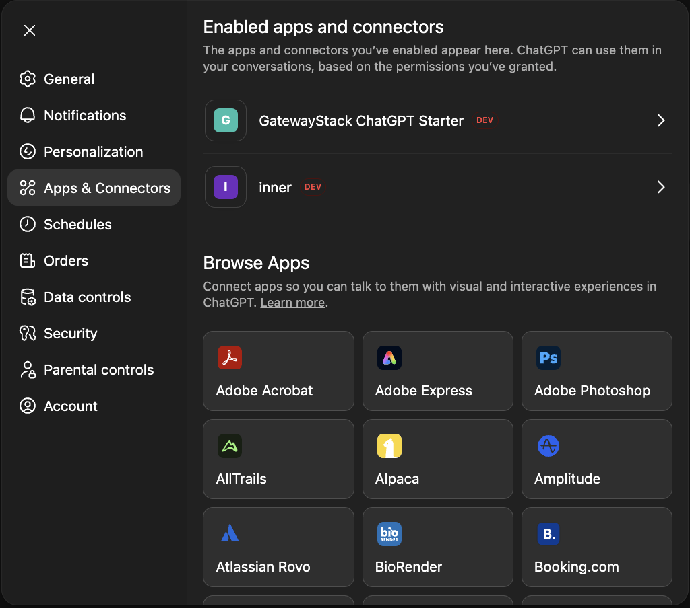

# Live Demo: Use This MCP Server Directly From ChatGPT (No Code Required)

**Expose internal tools to LLMs — securely — in 2 minutes**

<video src="https://github.com/user-attachments/assets/aa14fce5-442d-4fec-9a76-33d20e5b2ae0" controls width="100%"></video>

This guide shows how to connect ChatGPT to a live, running MCP server built from this repo — with OAuth login and real user identity, end to end.

The demo deployment runs this exact codebase on Cloud Run via Cloud Build CI/CD. You can experience the full MCP + OAuth flow without cloning, deploying, or configuring anything yourself.

This is ideal for demos, evaluations, internal pilots, and understanding how ChatGPT MCP + OAuth actually works in practice.

**[Jump to setup instructions](#add-the-mcp-server-to-chatgpt)**

## About this demo

This is a public demo deployment of `gatewaystack-chatgpt-starter`.

* Uses a dedicated demo OAuth tenant
* No user data is stored
* Demo tools are read-only
* Access may be rate-limited, reset, or disabled at any time

The goal is to demonstrate the exact ChatGPT MCP + OAuth flow you would deploy in your own environment.

## What you need

You only need:

* Access to **ChatGPT Enterprise** or **Plus**
* A browser where you can complete OAuth login

You do **not** need:

* The source code
* A local development environment
* A backend service
* Your own OAuth provider

## MCP base URL

**Demo Server:**
```
https://gatewaystack-chatgpt-starter-138953111861.europe-west1.run.app
```

This deployment exposes:

* MCP endpoint: `POST /mcp`
* OAuth discovery: `/.well-known/*`

## Add the MCP server to ChatGPT

<video src="https://github.com/user-attachments/assets/35c4b40e-a213-4a0b-a6c8-c31fdb978fef" controls width="100%"></video>

### Step 1: Open the MCP connectors UI

1. Open ChatGPT
2. Navigate to **Settings → Apps & Connectors**
3. Scroll to the bottom and open **Advanced settings**
4. Enable **developer mode**



### Step 2: Add a new MCP server

> ✅ **No client secret required.**
>
> This demo uses OAuth discovery + Dynamic Client Registration (DCR), so ChatGPT registers its own OAuth client and completes login without you copy/pasting credentials.
>
> ChatGPT acts as a public OAuth client using PKCE and Dynamic Client Registration.
> 
> This mirrors how production MCP integrations are expected to work — per-client registration, no shared secrets.

1. Navigate to **Settings → Apps & Connectors**
2. Click **Create app**
3. Fill in the form:

   - **Name:** `GatewayStack-ChatGPT-Starter`
   - **MCP Server URL:** `https://gatewaystack-chatgpt-starter-138953111861.europe-west1.run.app`
   - **Authentication:** OAuth  
4. Check the "I understand and want to continue" box
5. Click **Create**


## What happens behind the scenes

Once saved, ChatGPT immediately tests the connection:

1. ChatGPT calls `tools/list`
2. The server responds with a `WWW-Authenticate` header
3. ChatGPT discovers the OAuth issuer and required scopes
4. ChatGPT performs Dynamic Client Registration (DCR)
5. ChatGPT opens an OAuth login window
6. You authenticate with the demo IdP
7. ChatGPT retries the request with a Bearer access token

This is the same OAuth discovery and token flow used in production MCP integrations.

## Verify it works

Once authenticated, try calling the demo tool in ChatGPT. Send ChatGPT a message like:

```
open the gatewaystack tool and call whoami
```

You should receive a response showing:

* Your OAuth `sub` (subject)
* Granted scopes
* Tool permissions mapped from scopes


The response demonstrates the end-to-end identity + authorization chain:

**User → ChatGPT → MCP server → tool execution**

## What this demo proves

This demo demonstrates that:

* ChatGPT can discover OAuth-protected MCP servers
* OAuth login is triggered automatically
* JWT access tokens are validated correctly
* Tool access is gated by scopes
* Tools run with real user identity

This is the same pattern you would use for:

* Internal employee tools
* Enterprise AI agents
* User-scoped automation
* Auditable AI actions

## Available demo tools

**`whoami`**  
Returns your OAuth identity (sub, scopes, permissions). Requires scope: `read:profile`

**`echo`**  
Echoes back a message. Requires scope: `execute:tools`

These are minimal demo tools. In production, you'd replace these with tools that access real user data (calendars, CRM records, internal docs, etc.).

## Common demo issues

* **Repeated login prompts** → OAuth discovery endpoints misconfigured
* **401 `invalid_token`** → Issuer or audience mismatch
* **No tools listed** → Required scopes missing from the access token
* **Connection timeout** → Demo server may be under heavy load or rate-limited

See [troubleshooting.md](./troubleshooting.md) for detailed fixes.

## What's different from production?

This demo environment:

| Feature | Demo | Production |
|---------|------|------------|
| OAuth provider | Shared demo tenant | Your own IdP (Auth0, Okta, etc.) |
| User accounts | Demo credentials | Real employee/customer accounts |
| Backend integration | Mock tools only | Real APIs with user-scoped data |
| Rate limits | Shared across all demo users | Dedicated capacity |
| Data persistence | None (stateless) | Your database/services |

The **authentication and authorization patterns are identical** — you just plugin your identity provider and backend.

## Next steps

### Option 1: Deploy your own instance

If this demo makes sense and you want to build your own:

* Deploy your own instance → [deploy-your-own.md](./deploy-your-own.md)
* Set up Auth0 → [auth0-setup-guide.md](./auth0-setup-guide.md)
* Use another IdP → [other-idps.md](./other-idps.md)

### Option 2: Understand the architecture

* Read the main [README.md](../README.md) for the three-party problem explanation
* Review the [backend integration pattern](./backend-integration-pattern.md)
* Check out the [repo structure](../README.md#repo-layout)

### Option 3: Build custom tools

* See `src/tools/tools.ts` for tool definitions
* Learn about scope enforcement and output shaping
* Fork the repo and add your own tools

## Questions or issues?

* **Can't access ChatGPT developer mode?** → Make sure you are using ChatGPT Enterprise or Plus
* **Want to understand the code?** → See the main [README.md](../README.md) and repo documentation
* **Ready to deploy your own?** → See [deploy-your-own.md](./deploy-your-own.md)
* **Need to contact the develper?** → Email us at `reducibl@gmail.com`

## Contact

This demo exists to remove friction — the real value is in adapting the pattern to your own tools and users.

Powered by **[GatewayStack](https://github.com/gatewaystack)**.
Built by **[reducibl applied AI studio](https://reducibl.com)**  

Need help implementing your organization's tools in ChatGPT or Claude?  Check out our [implementation services](./consulting.md)